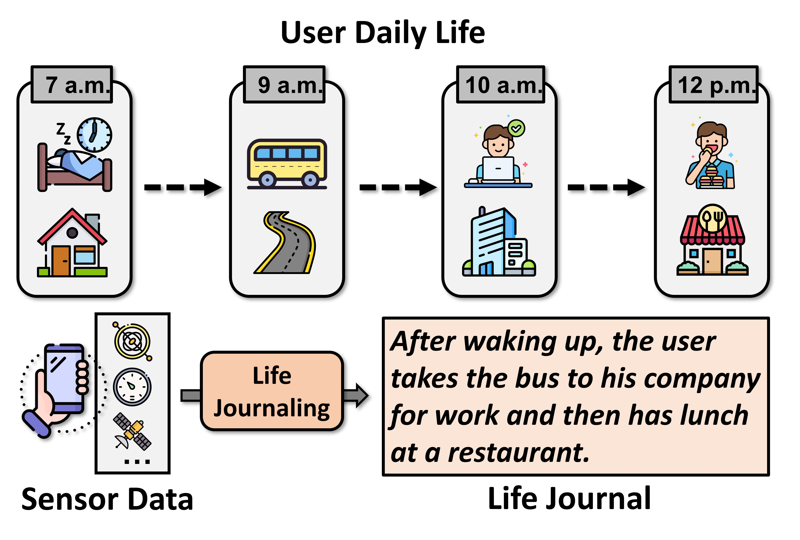

<p align="center">
  
</p>

<h1 align="center">🚀 AutoLife Dataset: Automatic Life Journaling with Smartphones and LLMs</h1>

<p align="center">
  <a href="#" target="_blank" rel="noopener noreferrer">
    
  </a>
  <a href="#" target="_blank" rel="noopener noreferrer">
    
  </a>
  <a href="https://github.com/WANDS-HKUST/AutoLife" target="_blank" rel="noopener noreferrer">
    
  </a>
  <a href="https://dl.acm.org/doi/10.1145/3680207.3765261" target="_blank" rel="noopener noreferrer">
    
  </a>
</p>


---
# AutoLife
The widespread adoption of mobile devices, especially smartphones, has fundamentally transformed how people interact with the physical world and generate personal data. Modern phones continuously capture rich multimodal signals such as motion, location, and environmental context, enabling new opportunities to understand human behavior at scale.

<p align="center">
  
</p>

**Life journaling** is an new application that aims to automatically generate semantic and factual descriptions of a person’s daily life from sensor data. Instead of relying on manual logging, life journaling systems can infer key activities, behaviors, transitions, and surrounding contexts, producing structured and natural summaries of daily experiences. Such capabilities enable a wide range of downstream applications, including personalized recommendations based on user behavior, automatic organization and annotation of personal photos and videos, analysis and optimization of daily routines for health and productivity, and long-term behavior understanding.

The **AutoLife Dataset** is designed to support research in automatic life journaling and mobile sensing. It contains multimodal smartphone sensor data aligned with **reference journals** describing user activities collected during a real-world user study. The dataset provides temporally synchronized sensor streams and human-readable annotations, enabling the development and evaluation of models for behavior recognition, temporal reasoning, multimodal fusion, and sensor-to-text generation.

This dataset serves as the official **benchmarking dataset** for our [IMWUT 2025 paper](https://dl.acm.org/doi/10.1145/3770683):  
👉 **“AutoLife: Automatic Life Journaling with Smartphone Sensors and Large Language Models”**  


---

# 📌 Dataset

This dataset contains:
- 📱 **Smartphone sensor data** (16 physical sensors like WiFi, Location, IMU) collected during real-world usage
- 📝 **Reference journals** describing user behaviors and activities
- ⏱️ **Metadata** for setup

Example scenarios include campus mobility, indoor stays, short transitions, and daily routines.

## Basic Statistics

| Metric | Value |
|--------|-------|
| Total duration | 370.02 hours |
| Mean segment duration | 2.20 hours |
| Median segment duration | 1.78 hours |

---

## ⚙️ Setup

We recommend using **Python 3.8 or later**.

First, clone the repository:

```bash
git clone https://github.com/WANDS-HKUST/AutoLife.git
cd AutoLife
```

Then install the required dependencies:

Install dependencies:
```bash
pip install -r requirements.txt
```

## 📥 Download Dataset

The raw sensor dataset is available via Google Drive.

### Option 1: Download via Command Line

You can download the dataset directly using the following command:

```bash
wget https://drive.google.com/uc?id=16hXedIOmaIZJ82wbdIaJIiGSw6bEF_PU -O autolife_data.zip
```

Then unzip the dataset:
```bash
unzip autolife_data.zip -d data/
```

### Option 2: Manual Download

Alternatively, you can download the dataset manually from Google Drive:

👉 [Download here](https://drive.google.com/file/d/16hXedIOmaIZJ82wbdIaJIiGSw6bEF_PU/view?usp=sharing)

After downloading, unzip the file and place the extracted folder in the root directory of this repository:

## 📂 Repository Structure
``` text
algorithm/
├── gis_apis.py                     // Helper functions for calling Google and AMap APIs
└── motion_detetction.py            // Algorithms for motion detection and step count
data/
├── experiment_1/                   // Raw sensor streams collected during one experiment
│   ├── sensor_session_1/           // Data collection session folder, named in 'HH_MM_SS' format
│   │   ├── accelerometer.csv       // Accelerometer measurements with timestamps
│   │   ├── gyroscope.csv           // Gyroscope measurements with timestamps
│   │   ├── location.csv            // Location samples with timestamps
│   │   ├── wifi.csv                // WiFi scan records with timestamps
│   │   ├── label.csv               // Experiment start/end time and segment labels
│   │   └── [other_sensor].csv      // Other available sensor modalities
│   ├── sensor_session_2/
│   │   └── ...
│   └──  ...
├── experiment_2/                   // Raw sensor streams collected during one experiment
├── experiment_3/
├── ...
└── experiment_N/
journals_reference.json         // Reference journals describing user behaviors and activity annotations
journals_generated_sample.json  // Samples of generated journals derived from sensor data
meta.json                       // Dataset-level metadata about devices and experimenter
sensortool.py                   // Helper script for reading raw sensor data
lj_evaluation.py                // Helper script for evaluating the generated journals
```
## 🗂️ Sensor Data

The `data/` directory contains all raw sensor data. Each `experiment/` folder represents data collected from a single experiment, typically spanning a long duration (e.g., around 5 hours).

Within each experiment, the data is further divided into multiple **sensor sessions**, where each session is stored in a separate folder (e.g., `sensor_session_1/`). A sensor session corresponds to a short data collection window of **15 seconds**, and a new session is initiated every **1 minute**.

Each session folder includes multiple CSV files, one per sensor, recording time-series measurements during that window. For detailed explanations of the sensor data formats and CSV contents, please refer to [`data/README.md`](data/README.md).

## Reference Journals

The reference journals provide **ground-truth descriptions of user behaviors and activities**, and are stored in the file `reference_journals.json`. These journals serve as semantic annotations aligned with the collected sensor data.

Each entry in the JSON file is a **key–value pair**:

- **Key (`k`)**: Identifies the data collection period and device  
- **Value (`v`)**: Contains the reference journal content and metadata

Examples:
```text
{
  "mobile_j240615_[2106-2151]": {
    "reference_journals": [ // List of reference journal entries
      "In the evening, the user browses a shopping mall.", 
      "In the evening, the user explores a shopping mall."
    ],
    "duration": 16, // Duration in minutes
    "experimenter": "A", // experimenter ID
    "device": "j" // device ID
  }
}
```
Each key follows the format:
```
mobile_[device_id][date: YYMMDD][start_time-end_time]
```
For example, `mobile_j240322_[1717-1746]` indicates that the data was collected using device `j` on **2024-03-22**, from **17:17 to 17:46** (24-hour format).

The value associated with each key contains metadata and reference journals.
# Usage

##  Processing Sensor Data

We provide a script, `life_journaling_template.py`, to help you read and process sensor data from a single experiment session.

Run the script as follows:

```bash
python process_template.py <experiment_dir> <output_dir>
```
For example:
```bash
python life_journaling_template.py a241107 a241107_results
```
This command processes sensor data from `data/a241107` and saves the processed results and log files to `saved/a241107_results`.

The `process_template.py` script includes:
- Utility functions for processing raw sensor data
- A placeholder section where you can add your own data processing logic

If you would like to understand how raw sensor data is loaded and parsed, please refer to `sensortool.py`.
##  Journal Evaluation
`lj_evaluation.py`
# ⚠️ Important Reminders and Limitations

When using this dataset, please keep the following points in mind:

1. **Participant Device Usage**  
   Participants carried smartphones while going about their daily lives to mimic natural, real-world behaviors. However, in most cases, participants did **not frequently interact** with the experiment device, as it was **not their personal smartphone**. As a result, interaction-driven signals (e.g., app usage or screen events) may be absent.

2. **Session Interruptions and Missing Data**  
   Although sensor sessions were configured to start **once per minute**, Android system constraints (e.g., background execution limits, idle states) may pause or delay data collection. Consequently, some experiments contain **long periods of missing sensor data**. This reflects a **realistic challenge** in deploying life journaling systems in the wild.

3. **Connectivity and Sensor Availability**  
   Most experimental smartphones did **not have continuous network connectivity**. As a result, **location data may be missing**, especially in indoor environments. Additionally, many devices lack barometer and some sensors only report new values when a change is detected (e.g., **step counter**).

4. **Recommended Usage of the Dataset**  
   We **do not recommend** using this dataset to directly train models (e.g., LLMs or MLLMs) for end-to-end life journaling. Human behaviors are highly complex, and this dataset covers only a **small set of activities and locations**. Instead, the dataset is better suited for:
   - Few-shot prompting or evaluation of LLMs
   - Benchmarking behavior understanding pipelines
   - Studying sensor-to-text alignment under real-world constraints

5. **Reference Journals**
   
   After the experiment, participants were asked to provide a short summary of their behaviors during the study period, which serves as reference journals for evaluation. We observed substantial diversity in how participants wrote their journals, including differences in:
    - **Writing styles and formats**
    - **Granularity of descriptions** (e.g., location described at the city / area / building / store level)
    - **Intent or purpose** (e.g., *going somewhere for something*)
    - **Subjective feelings and reflections**
   
   To enable **unified and fair evaluation**, we standardized these reference journals by unifying formats and removing subjective feelings. It is important to note that in real-world life journaling, **all of this information is valuable**. Users may prefer different styles, levels of detail, and emotional expressions. Our standardization is solely for evaluation purposes and does not reflect an ideal or recommended journaling style in practice.

# 📖 Citation

If you use this dataset in your research, please cite our [IMWUT 2025 paper](https://dl.acm.org/doi/10.1145/3770683):

```bibtex
@article{xu2025autolife,
  title={AutoLife: Automatic Life Journaling with Smartphones and LLMs},
  author={Xu, Huatao and Zeng, Zilin and Tong, Panrong and Li, Mo and Srivastava, Mani B.},
  journal={Proceedings of the ACM on Interactive, Mobile, Wearable and Ubiquitous Technologies},
  volume={9},
  number={4},
  pages={1--29},
  year={2025},
  publisher={ACM New York, NY, USA}
}
```
